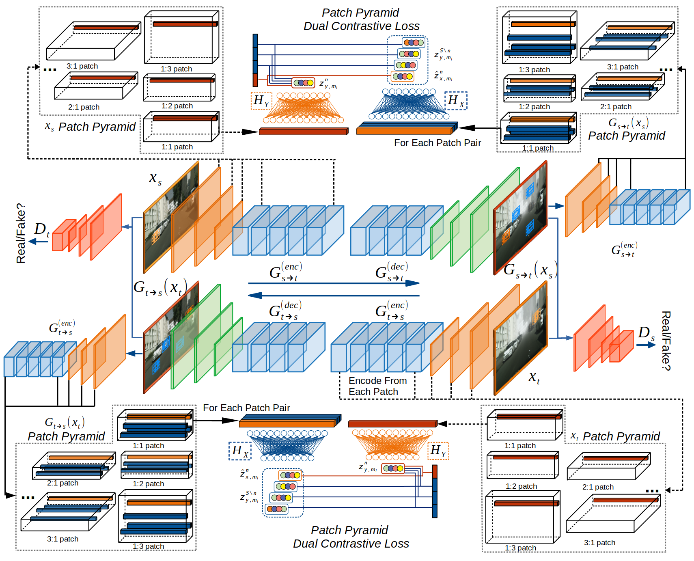
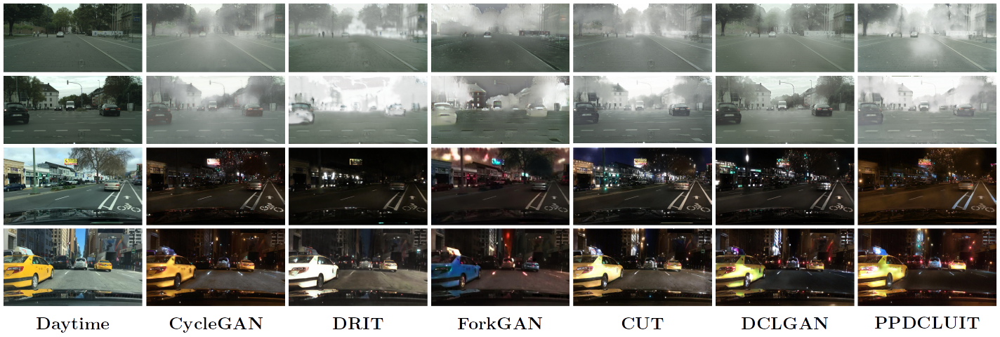
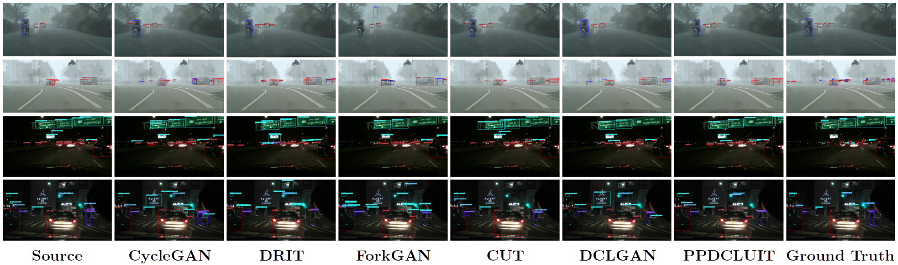

# Unsupervised Image-to-Image Translation with Patch Pyramid Dual Contrastive Learning for Cross Domain Object Detection   

 

   

This repository contains our PyTorch implementation of Unsupervised Image-to-Image Translation with Patch Pyramid Dual Contrastive Learning for Cross Domain Object Detection (PPDCLUIT). In this paper, we propose **P**atch **P**yramid **D**ual **C**ontrastive **L**earning **U**nsupervised **I**mage **T**ranslation (PPDCLUIT) framework to strength the cross domain object detection performance. Built upon the architecture of [CUT](https://github.com/taesungp/contrastive-unpaired-translation) and [DCLGAN](https://github.com/JunlinHan/DCLGAN), our method present a patch pyramid dual contrastive learning startegy for coherent associations at each specific location and include identity loss to further enforce the object instances preservation.  Trained on the images translated by our OA-FSUI2IT, object detection methods (i.e. Faster RCNN, FCOS) can achieve better mAP than those trained on source only, as well as those domain adaptation based methods. As the processing time for our detection framework is determined by the inference time of the employed detector, it can be used for online object detection. 

    

   

### **Patch Pyramid Dual Contrastive Learning Unsupervised Image Translation Network**  

   

   

## Translation Results  

### Cityscapes Clear to Foggy  

Qualitative results:  

Quantitative results:   

| Method      |  FID &#8595;  | Precision &#8593; | Recall &#8593; | Density &#8593; | Coverage &#8593; |
|-------------|:--------:|:-----------:|:--------:|:---------:|:----------:|
| Source Only |   68.71   |   0.009   |  0.566   |  0.002  |   0.016  |
| CycleGAN    |   45.10   |   0.767   |  0.304   |  **0.729**  |   0.782  |
| CUT         |   42.56   |   0.668   |  0.498   |  0.592  |   **0.930**  |
| DCLGAN      |   48.95   |   0.276   |  0.394   |  0.098  |   0.338  |
| PPDCLUIT    |   **41.96**   |   0.167   |  **0.688**   |  0.053  |   0.340  |

### BDD100K Day to Night  

Quantitative results:   

| Method      |  FID &#8595;  | Precision &#8593; | Recall &#8593; | Density &#8593; | Coverage &#8593; |
|-------------|:--------:|:-----------:|:--------:|:---------:|:----------:|
| Source Only |   104.63  |   0.181   |  0.413   |  0.046  |   0.022  |
| CycleGAN    |   17.90   |   0.763   |  0.594   |  0.828  |   0.782  |
| CUT         |   24.17   |   0.711   |  **0.673**   |  0.681  |   0.658  |
| DCLGAN      |   21.92   |   0.784   |  0.485   |  0.965  |   0.633  |
| PPDCLUIT    |   **14.11**   |   **0.842**   |  0.566   |  **1.265**  |   **0.806**  |

## Detection Results

Qualitative results:  

## t\-SNE Result  
To validate our translation method, we use TSNE to visualize distribution of images from source domain, target domain and generated.   

### Acknowledgments   
Our code is developed based on [contrastive-unpaired-translation](https://github.com/taesungp/contrastive-unpaired-translation/) and [DCLGAN](https://github.com/JunlinHan/DCLGAN). We also thanks [pixplot](https://github.com/YaleDHLab/pix-plot) for t\-SNE visualization.   
